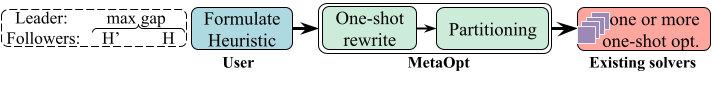

# MetaOpt: Examining, explaining, and improving heuristic performance

`MetaOpt` is the first general-purpose and scalable tool that enables users to analyze a broad class of heuristics through easy-to-use abstractions that apply to a broad range of practical heuristics. For more information, checkout [MetaOpt's project webpage](https://www.microsoft.com/en-us/research/project/finding-adversarial-inputs-for-heuristics/overview/) and our NSDI'24 paper ([Finding Adversarial Inputs for Heuristics using Multi-level Optimization](https://arxiv.org/abs/2311.12779)).


## Code Structure
```
├── MetaOptimize               # Implementation of all the main components of MetaOpt.
|      |                       # (helper functions, solver APIs, rewrites, etc.)
|      |       
|      ├── TrafficEngineering  # implementation of TE encoders (OPT, DP, and POP)
|      |                       # and TE adversarial generator.
|      |
|      ├── VectorBinPacking    # implementation of VBP encoders (OPT and variants of FF)
|      |                       # and VBP adversarial generator.
|      |
|      ├── PIFO                # implementation of PIFO, SP-PIFO, and AIFO encoders.
|      |
|      |
|      └── FailureAnalysis     # Implementation for failure analysis (RAHA SIGCOMM 2025).
|
|
├── MetaOptimize.Cli           # examples and scripts to reproduce the results in
|                              # our NSDI24 and HotNet22 papers.
|
├── MetaOptimize.Test          # testcases for MetaOpt.
|
├── parsers                    # codes for parsing the log files
|                              # and ploting some of the results.
|
└── Topologies                 # topologies for our TE experiments.


```

## Getting Started

### Dependencies
You can use MetaOpt either with the [Gurobi optimization solver](https://www.gurobi.com/documentation/current/examples/cs_examples.html) 
or with [Zen](https://dl.acm.org/doi/10.1145/3422604.3425930).

NEW: MetaOpt also now supports ORTools CSIP solver. Install the solver through [Nuget Package Manager](https://www.nuget.org/packages/Google.OrTools). [Caution: ORTools does not provide all the features that are available in Gurobi.]

Make sure you install any solver that you use. For Gurobi, you can also use [NuGet Package Manager](https://www.nuget.org/packages/Gurobi.Optimizer) and run the following command:
```bash
dotnet add package Gurobi.Optimizer --version 10.0.2
```

You also need to configure a proper Gurobi license. If you are in academia, you can follow the instructions on Gurobi's website to obtain one.

### Working Examples

We provide multiple example Main functions that you can try in `MetaOptimize.Cli/MainEntry.cs` for different heuristics in vector bin packing, packet scheduling, and traffic engineering. To run `MainEntry.cs`:
```bash
cd MetaOptimize.Cli
dotnet run
```

We also provide many unittests that can serve as a starting point in `MetaOptimize.Test`.

## Analyzing heuristics using MetaOpt

<p align="center">

</p>


If you would like to analyze a heuristic that we have not modeled as part of MetaOpt yet, here are the steps to follow:

1- Model your heuristic as either a convex optimization problem or a feasibility problem which our solvers can support.
How you model the problem is important and can significantly influence MetaOpt's ability to scale (and also whether Gurobi can run into
numerical issues). If you run into trouble with this step, feel free to contact the MetaOpt authors at: namyar@usc.edu and bearzani@microsoft.com.

2- You need to write an `Encoder` library for both the heuristic you want to analyze and the optimal form of the problem (or if you want to compare two heuristics, for the other heuristics). 
We strongly recommend looking at the Traffic Engineering, VBP, and packet scheduling Encoders we have provided as part of the MetaOpt code-base for examples. 
Encoders must meet the specifications in the `IEncoder.cs` library. 
If your problem is a convex optimization problem (and NOT a feasibility problem), you also need to pick the type of re-write you want to use (`KKT` or `quantized primal dual`).
We recommend the quantized primal dual approach to achieve better scalability.

To use the quantized primal dual approach, you also need to specify the quantization levels.

3- Once you have both of the encoders in place, you have to write an adversarial input generator. See the `TE` and `VBP` folders for examples.
To solve the MetaOpt problem, you need to create the `input variables` in the adversarial input generator and pass the SAME input variables to the encoders
for the algorithms you want to analyze.
Also notice that the adversarial input generator and the two encoders need to use the same solver instance.

To see examples of this workflow, we highly recommend looking at the test cases in `MetaOptimize.Test`.

## Citations
Refer to the following two papers for more information:
```bibtex
@inproceedings{metaopt,
  author = {Namyar, Pooria and Arzani, Behnaz and Beckett, Ryan and Segarra, Santiago and Raj, Himanshu and Krishnaswamy, Umesh and Govindan, Ramesh and Kandula, Srikanth},
  title = {{F}inding {A}dversarial {I}nputs for {H}euristics using
                    {M}ulti-level {O}ptimization},
  booktitle = {21st USENIX Symposium on Networked Systems Design and
                    Implementation (NSDI 24)},
  year = {2024},
}
```
```bibtex
@inproceedings{Raha,
  author = {Arzani, Behnaz and Taheri, Sina and Namyar, Pooria, and Beckett, Ryan, and Kakarla, Siva and Jallilipour, Elnaz},
  title = {{R}aha: {A} {G}eneral {T}ool to {A}nalyze {W}AN {D}egradation},
  booktitle = {Proceedings of the ACM SIGCOMM 2025 Conference},
  year = {2025},
}
```

```bibtex
@inproceedings{10.1145/3563766.3564102,
  author = {Namyar, Pooria and Arzani, Behnaz and Beckett, Ryan and Segarra, Santiago and Raj, Himanshu and Kandula, Srikanth},
  title = {Minding the gap between fast heuristics and their optimal counterparts},
  booktitle = {Proceedings of the 21st ACM Workshop on Hot Topics in Networks},
  year = {2022}
}
```

## Contributing

This project welcomes contributions and suggestions.  Most contributions require you to agree to a
Contributor License Agreement (CLA) declaring that you have the right to, and actually do, grant us
the rights to use your contribution. For details, visit https://cla.opensource.microsoft.com.

When you submit a pull request, a CLA bot will automatically determine whether you need to provide
a CLA and decorate the PR appropriately (e.g., status check, comment). Simply follow the instructions
provided by the bot. You will only need to do this once across all repos using our CLA.

This project has adopted the [Microsoft Open Source Code of Conduct](https://opensource.microsoft.com/codeofconduct/).
For more information see the [Code of Conduct FAQ](https://opensource.microsoft.com/codeofconduct/faq/) or
contact [opencode@microsoft.com](mailto:opencode@microsoft.com) with any additional questions or comments.

## Trademarks

This project may contain trademarks or logos for projects, products, or services. Authorized use of Microsoft 
trademarks or logos is subject to and must follow 
[Microsoft's Trademark & Brand Guidelines](https://www.microsoft.com/en-us/legal/intellectualproperty/trademarks/usage/general).
Use of Microsoft trademarks or logos in modified versions of this project must not cause confusion or imply Microsoft sponsorship.
Any use of third-party trademarks or logos are subject to those third-party's policies.

## Contacts
You can reach out to us with any questions:
- Behnaz Arzani (bearzani@microsoft.com)
- Pooria Namyar (namyar@usc.edu)
